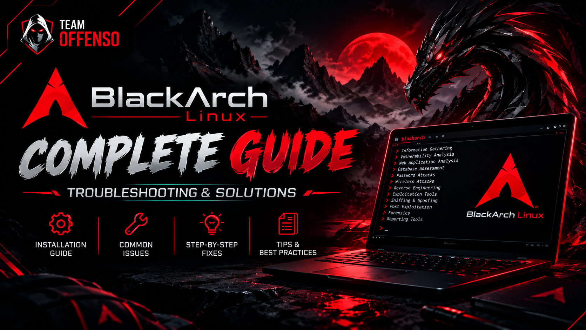
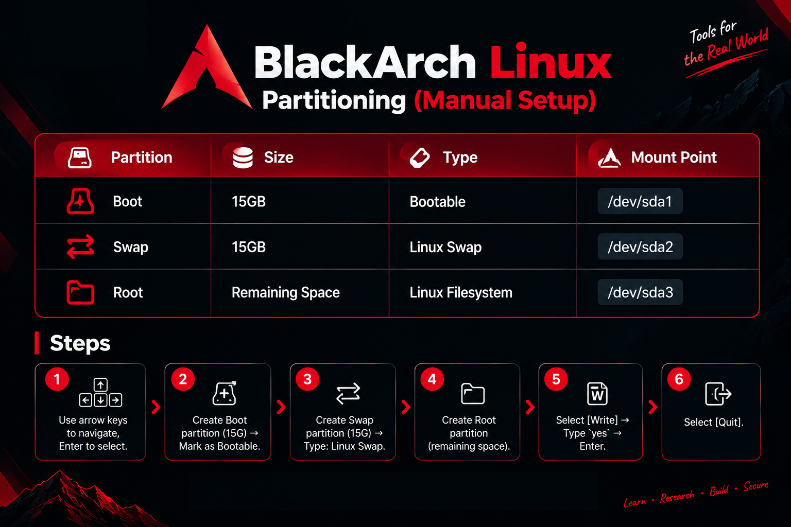

  

#  BlackArch Linux: Complete Installation & Troubleshooting Guide

> **A comprehensive guide for BlackArch Linux installation, configuration, and problem-solving.**
> > ⚠️ This is a community-created learning guide, not official BlackArch documentation. Always verify installation and system-maintenance procedures against the current BlackArch and Arch Linux documentation.

> > Created by **Creed Knoxx** 🛡️  
> Cybersecurity Researcher | Ethical Hacker | Pentester | Founder, Team Offenso

>📢 Telegram: https://t.me/team0ffenso_official

>📘 Facebook: https://www.facebook.com/Teamoffenso

>📸 Instagram: https://www.instagram.com/teamoffenso/

---

## 📑 Table of Contents

1. [Introduction to BlackArch](#1-introduction-to-blackarch)
2. [Related Linux Distributions](#2-related-linux-distributions)
3. [Who Should Use BlackArch & Why](#3-who-should-use-blackarch--why)
4. [Download BlackArch ISO](#4-download-blackarch-iso)
5. [VMware/VirtualBox Setup](#5-vmwarevirtualbox-setup)
6. [Installation Process](#6-installation-process-step-by-step)
7. [Post-Installation Configuration](#7-post-installation-configuration)
8. [System Updates & Synchronization](#8-system-updates--synchronization)
9. [Tools & Repository Installation](#9-tools--repository-installation)
10. [Desktop Environment & GUI Setup](#10-desktop-environment--gui-setup)
11. [Customization](#11-customization-themes--backgrounds)
12. [Troubleshooting](#12-troubleshooting--problem-solving)
13. [Disclaimer](#13-disclaimer)

---

## 1. Introduction to BlackArch

**BlackArch Linux** is a powerful penetration testing distribution based on Arch Linux, designed specifically for security researchers, ethical hackers, and penetration testers.

### Key Features:
- 🛠️ **2,800+ Security Tools** - Categorized for various cybersecurity tasks
- ⚡ **Lightweight & Customizable** - Supports multiple desktop environments
- 🔄 **Rolling Release Model** - Continuously updated packages and tools
- 📦 **Fast Package Management** - Uses `pacman` and `blackman`
-  **Flexible Deployment** - Standalone, dual-boot, or live ISO

---

## 2. Kali vs Parrot OS vs BlackArch

| Feature | Kali Linux | Parrot OS | BlackArch Linux |
| :--- | :--- | :--- | :--- |
| **Base OS** | Debian | Debian | Arch Linux |
| **Package Manager** | `apt` | `apt` | `pacman` |
| Security Focus | Penetration testing, security auditing | Security, privacy, development | Penetration testing, security research |
| Release Model | Rolling | Rolling | Rolling |
| **Customization** | High | High | **Very High** |
| **Target Audience** | Beginners | Privacy-focused | **Advanced Users** |
| Security Tools | Large curated collection | Security-focused toolsets | 2,800+ tools in repository |
> Tool counts and package availability change over time. Check each project's official documentation for current information.
---

## 3. Who Should Use BlackArch & Why

### Who Should Use It:
- ✅ Penetration testers & Red Team professionals
- ✅ Security researchers & ethical hackers
- ✅ Forensic analysts & reverse engineering experts
- ✅ Anyone seeking a lightweight yet powerful pentesting OS

### Why Choose BlackArch:
1. **Massive Tool Collection** - 2,800+ security tools available through the BlackArch repository
2. **Arch Linux Base** - Rolling release, bleeding-edge updates
3. **Highly Customizable** - Install only what you need
4. **Professional-Grade** -  Security-Focused - Provides a large collection of tools for penetration testing, security research, forensics, reverse engineering, and related workflows
5. **Community-Driven** - Active security community support

---

## 4. Download BlackArch ISO

- Full ISO — Complete BlackArch environment with the available tools at build time
- Slim ISO — Lightweight environment with a selected set of tools
- Netinstall ISO — Minimal installer that downloads required packages during installation
- **Full ISO (Offline Installation):** [Download Here](https://blackarch.org/downloads.html#install-iso)
- **Slim ISO (Online Installation):** [Download Here](https://blackarch.org/downloads.html#install-iso)
- **Netinstall ISO (Online Installation):** [Download Here](https://blackarch.org/downloads.html#install-iso)
---

## 5. VMware/VirtualBox Setup

### The following is an example VM configuration for learning and lab use. 
Actual requirements depend on the desktop environment, tools, workload, and host system.

### Example Configuration

- Guest OS: Linux / Arch Linux (64-bit)
- CPU: 2–4 virtual CPUs
- RAM: 4–8 GB
- Storage: 40–80 GB or more depending on tools and snapshots
- Network: NAT or Bridged, depending on your lab requirements
- Enable hardware virtualization (Intel VT-x / AMD-V) in UEFI/BIOS if required

> These are example lab settings, not official BlackArch minimum requirements.

---

## 6. Installation Process (Step-by-Step)

### Boot & Initial Setup:

1. Power on VM and boot from ISO

2. **Default Credentials:**
   - User: `root`
   - Password: `blackarch`
 > ⚠️ These credentials are for the live installation environment. After installation, create and use a normal user account and set your own credentials.

3. **Set Desktop Theme:**
   - Right-click desktop → Fluxbox Menu → System Styles → Choose `Arch` (recommended)

4. Open terminal and run:--    blackarch-install
   
   Interactive Installation Steps:

Install Type: Type 2 (Full-ISO offline) → Enter

Locale: Choose 1 → Enter

Keymap: Choose 1 → Enter

Hostname: Set your desired hostname

Device: Choose sda (or your disk)

Prompts: Type y for:

BlackArch with Window/other OS

Partitions

Create zeroed Partition Table

Partition Table Type: Choose dos

Partitioning (Manual Setup):

Steps:------

Use arrow keys to navigate, Enter to select

Create Boot partition (1G) → Mark as Bootable

Create Swap partition (4G) → Type: Linux Swap

Create Root partition (remaining space)

> **Note:** The partition-table type depends on the system's boot mode. `dos`/MBR is applicable to BIOS/legacy setups; UEFI systems normally use GPT with an EFI System Partition.

Select [Write] → Type yes → Enter

Select [Quit]

Finalize Installation:

Encryption: Type y (for safety)
### Disk Encryption

BlackArch's installer can provide full-root encryption using LUKS.

> Enable encryption if you understand the recovery and password requirements. Losing the encryption password/passphrase can make the encrypted data inaccessible.

Confirm Partitions:

/dev/sda1 - Boot

/dev/sda2 - Swap

/dev/sda3 - Root

Type y → Installation starts automatically

After completion: Type reboot.

. Post-Installation Configuration

Enable Internet Connection:----

systemctl enable dhcpcd

systemctl start dhcpcd
### Network Configuration

Verify that the system has network connectivity:

ip a

ip route

ping -c 3 archlinux.org

Initialize Pacman Keyring:---

rm -rf /etc/pacman.d/gnupg
### Initialize Pacman Keyring

pacman-key --init

pacman-key --populate archlinux blackarch

pacman -S archlinux-keyring blackarch-keyring

pacman-key --update --keyserver keyserver.ubuntu.com

pacman -Syu archlinux-keyring blackarch-keyring
> ⚠️ Do not delete `/etc/pacman.d/gnupg` as a routine troubleshooting step. Only rebuild the keyring directory when a specific documented recovery procedure requires it.

If Key Installation Fails:---

pacman-key --init

pacman-key --refresh-keys

pacman -Syyu archlinux-keyring blackarch-keyring

. System Updates & Synchronization

Sync Database:----

pacman -Syy

Full System Update:---

pacman -Syyu
# OR

pacman -Syu

. Tools & Repository Installation

Install BlackArch Tools:----

pacman -S blackarch

pacman -S blackman
## Tools & Repository Installation

### Install all BlackArch tools

sudo pacman -S blackarch

Install Window Manager & Git:---

pacman -S thunar    # File manager

pacman -S git       # Version control

. Desktop Environment & GUI Setup

Cinnamon Desktop:---

pacman -S cinnamon

GNOME Desktop:---

pacman -S gnome

Budgie Desktop:--

sudo pacman -S budgie-desktop gnome-control-center

sudo pacman -S adwaita-icon-theme arc-icon-theme adapta-gtk-theme arc-gtk-theme breeze-gtk

💡 Pro Tip: After installing GUI, enable display manager:----

sudo systemctl enable gdm      # For GNOME

sudo systemctl enable lightdm  # For Cinnamon

. Customization (Themes & Backgrounds)

Method 1: Temporary Change (using feh)----

feh --bg-center /root/Downloads/photo_name.jpg

# OR

feh --bg-scale /root/Downloads/photo_name.jpg

Method 2: Permanent Change (Editing Overlay)-

cd /usr/share/blackarch

ls

cd config/fluxbox/

nano overlay

.Add these lines to overlay file:---

! The following line will prevent styles from setting the background

Background: fullscreen

Background: pixmap:/home/root/Downloads/photo_name.jpg

OR

Background: pixmap:/home/root/file or path name.jpg

Save: Ctrl+O → Enter → Exit: Ctrl+X

Shortcut Method:--

cd ~/.fluxbox/

. Disclaimer--------

"Ethics Comes Before Hacking."
This guide is strictly for educational purposes and authorized security testing. The authors and contributors are not responsible for any misuse of the information provided. Always obtain proper written permission before testing any system.

##  Keywords
blackarch problem solving, blackarch troubleshooting, blackarch update error, 
blackarch pacman error, blackarch pgp signature error, blackarch installation guide, 
blackarch vmware setup, blackarch virtualbox, blackarch gui setup, 
blackarch keyring error, blackarch mirror error, arch linux pentesting, 
kali linux alternative, cybersecurity tools, ethical hacking guide
nano overlay

